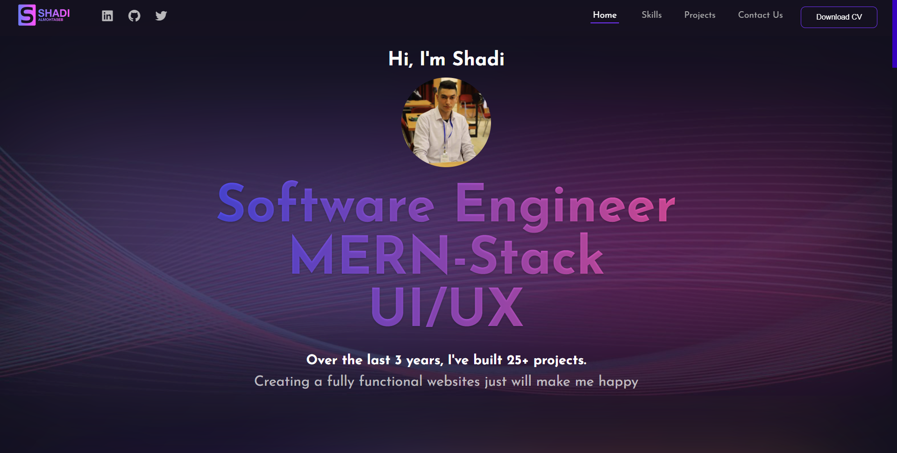
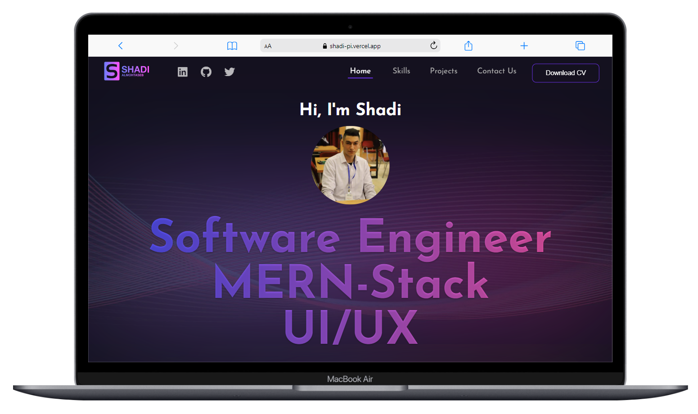
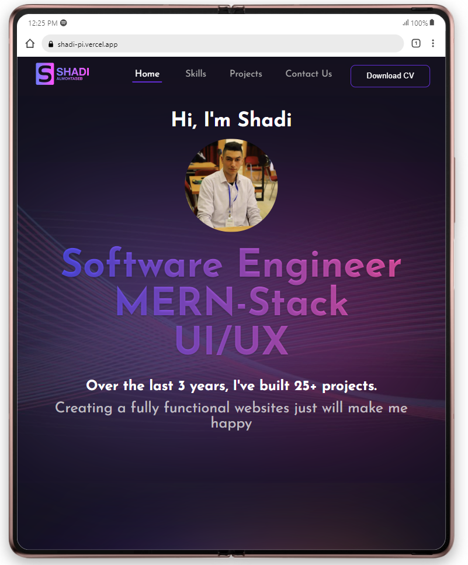
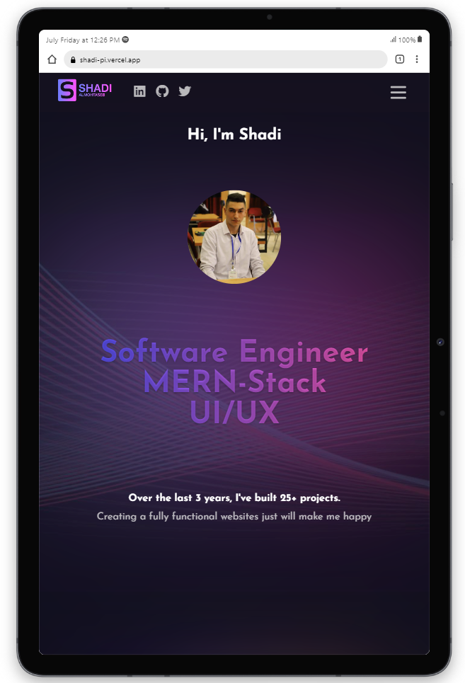
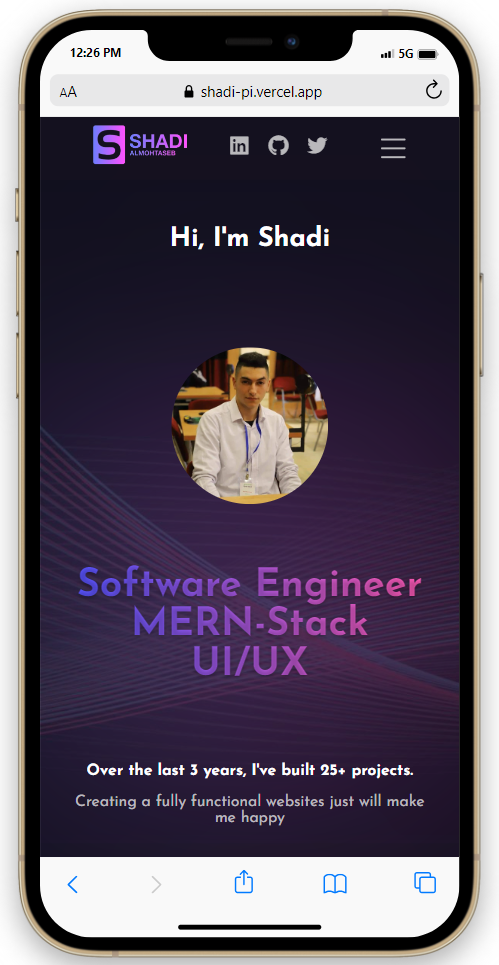

# Portfolio

Explore my fully responsive portfolio, skillfully built from scratch using HTML, CSS, and JS. Inspired by my Figma design, I brought it to life across all screens, ensuring an enjoyable user experience,
every screen reflects my dedication to creating an engaging user experience from ideation to implementation.

## Learning Objectives

- Semantic `HTML`.
- Responsive `CSS` design.
- Important `JS` concepts.

## Demo

[See The Demo From Here!
](https://shadi-pi.vercel.app/)

## App Preview

